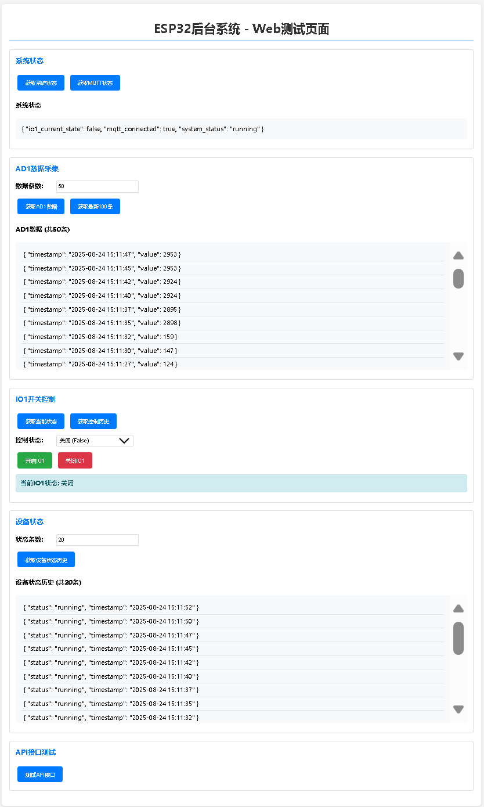
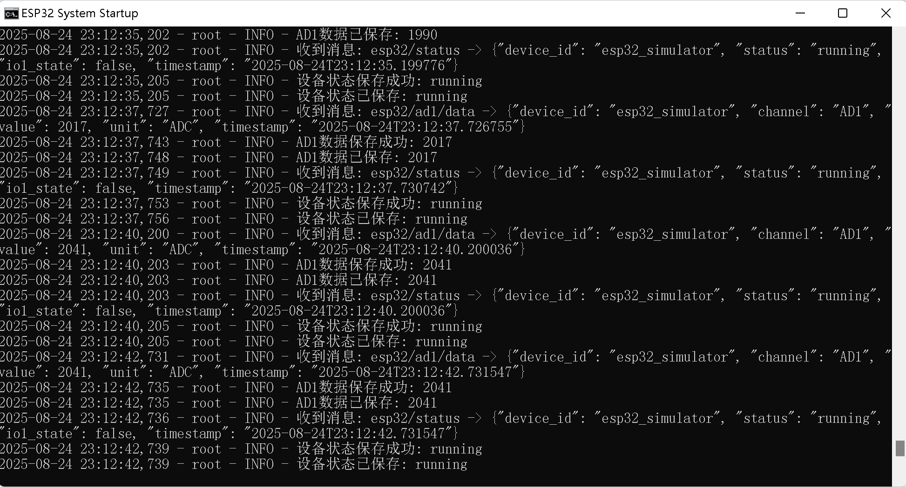
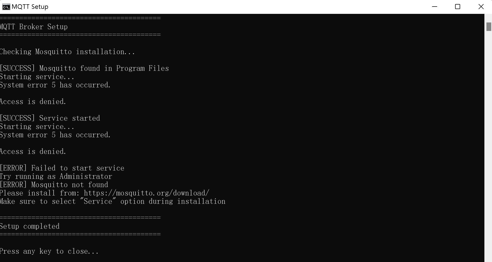
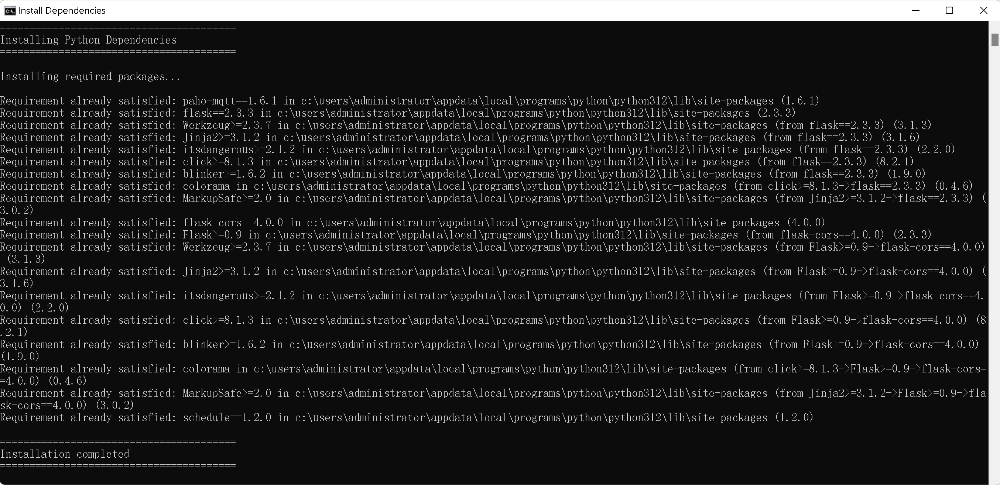

# ESP32数据采集和控制系统

## 项目简介

这是一个基于Python的ESP32数据采集和控制系统，支持北向采集AD1通道数据，南向控制IO1开关。系统采用MQTT通信协议，JSON数据格式，提供完整的后台管理和Web API接口。

## 系统架构

```
┌─────────────┐    MQTT    ┌─────────────┐    HTTP    ┌─────────────┐
│   ESP32     │◄──────────►│   后台系统   │◄──────────►│   Android   │
│  设备/模拟器 │            │             │            │     APP     │
└─────────────┘            └─────────────┘            └─────────────┘
                                │
                                ▼
                        ┌─────────────┐
                        │   SQLite    │
                        │   数据库    │
                        └─────────────┘
```

## 功能特性

### 北向数据采集
- **AD1通道数据采集**: 实时采集模拟量数据
- **数据存储**: 自动保存到SQLite数据库
- **历史查询**: 支持按时间范围查询历史数据

### 南向设备控制
- **IO1开关控制**: 远程控制数字输出
- **状态反馈**: 实时获取设备控制状态
- **控制历史**: 记录所有控制操作

### 通信协议
- **MQTT协议**: 轻量级消息传输
- **JSON格式**: 标准数据交换格式
- **主题订阅**: 支持多设备接入

### 系统管理
- **Web API**: RESTful接口供APP调用
- **实时监控**: 系统状态实时监控
- **日志记录**: 完整的操作日志

## 系统要求

- **操作系统**: Windows 11/10
- **Python版本**: 3.7+
- **MQTT代理**: Mosquitto
- **内存要求**: 最小512MB，推荐1GB+
- **存储空间**: 最小100MB

## 📸 应用界面展示

### 1. web应用界面


### 2. 后台服务界面


### 3. 后台服务连续输出界面


### 4. MQTT安装界面


### 5. 安装python相关依赖界面



## 快速开始

### 1. 环境准备

#### 安装Python
```bash
# 下载并安装Python 3.7+
# 下载地址: https://www.python.org/downloads/
```

#### 安装MQTT代理
```bash
# 运行安装脚本
install_mqtt.bat

# 或手动安装
# 1. 访问 https://mosquitto.org/download/
# 2. 下载Windows版本安装包
# 3. 安装时选择"Service"选项
```

### 2. 一键部署

#### 安装依赖
```bash
# 运行依赖安装脚本
install_dependencies.bat
```

#### 启动系统
```bash
# 运行一键启动脚本
start_system.bat
```

### 3. 验证系统

#### 检查服务状态
- MQTT服务: 默认端口1883
- Web服务: http://localhost:5000
- 数据库: 自动创建SQLite文件

#### 测试功能
```bash
# 运行系统测试脚本
test_system.bat
```

#### Web测试页面
- 打开 `web_test.html` 文件
- 测试各项API接口功能

## 配置说明

### 配置文件 (config.ini)

```ini
[MQTT]
broker = localhost          # MQTT代理地址
port = 1883                # MQTT端口
client_id = esp32_backend  # 客户端ID
username =                 # 用户名（可选）
password =                 # 密码（可选）
keepalive = 60            # 保活时间

[TOPICS]
ad1_data = esp32/ad1/data           # AD1数据主题
io1_control = esp32/io1/control     # IO1控制主题
status = esp32/status               # 状态主题

[DATABASE]
db_path = esp32_data.db             # 数据库文件路径

[WEB_SERVER]
host = 0.0.0.0                      # Web服务器地址
port = 5000                         # Web服务器端口
debug = True                        # 调试模式

[ESP32_SIMULATOR]
enabled = True                      # 启用模拟器
simulation_interval = 5             # 模拟间隔（秒）
ad1_min = 0                        # AD1最小值
ad1_max = 4095                     # AD1最大值
io1_default = False                # IO1默认状态
```

## API接口文档

### 基础信息
- **基础URL**: `http://localhost:5000/api`
- **数据格式**: JSON
- **编码方式**: UTF-8

### 接口列表

#### 1. 系统状态
```
GET /api/status
响应: {"success": true, "data": {"mqtt_connected": true, "io1_current_state": false, "system_status": "running"}}
```

#### 2. MQTT状态
```
GET /api/mqtt/status
响应: {"success": true, "data": {"connected": true}}
```

#### 3. AD1数据查询
```
GET /api/ad1/data?limit=100
参数: limit - 返回数据条数（可选，默认100）
响应: {"success": true, "data": [{"value": 1234, "timestamp": "2024-01-01T00:00:00"}]}
```

#### 4. IO1控制
```
POST /api/io1/control
请求体: {"state": true}
响应: {"success": true, "message": "IO1控制命令已发送: true"}
```

#### 5. IO1状态查询
```
GET /api/io1/current
响应: {"success": true, "data": {"state": false}}
```

#### 6. IO1控制历史
```
GET /api/io1/control?limit=50
参数: limit - 返回数据条数（可选，默认50）
响应: {"success": true, "data": [{"state": true, "timestamp": "2024-01-01T00:00:00"}]}
```

#### 7. 设备状态历史
```
GET /api/device/status?limit=50
参数: limit - 返回数据条数（可选，默认50）
响应: {"success": true, "data": [{"status": "online", "timestamp": "2024-01-01T00:00:00"}]}
```

#### 8. API测试
```
GET /api/test
响应: {"success": true, "message": "ESP32后台系统API运行正常", "timestamp": "2024-01-01T00:00:00Z"}
```

## MQTT通信协议

### 主题结构
- `esp32/ad1/data` - AD1数据发布
- `esp32/io1/control` - IO1控制命令
- `esp32/status` - 设备状态

### 消息格式

#### AD1数据
```json
{
    "device_id": "esp32_simulator",
    "channel": "AD1",
    "value": 2048,
    "unit": "ADC",
    "timestamp": "2024-01-01T00:00:00"
}
```

#### IO1控制
```json
{
    "command": "set_io1",
    "state": true,
    "timestamp": "2024-01-01T00:00:00"
}
```

#### 设备状态
```json
{
    "device_id": "esp32_simulator",
    "status": "online",
    "io1_state": false,
    "timestamp": "2024-01-01T00:00:00"
}
```

## 文件结构

```
AiUiIot/
├── README.md                 # 项目说明文档
├── requirements.txt          # Python依赖包
├── config.ini               # 系统配置文件
├── main.py                  # 主程序入口
├── database.py              # 数据库管理模块
├── mqtt_client.py           # MQTT客户端模块
├── esp32_simulator.py           # ESP32模拟器（已启用）
├── web_server.py            # Web服务器模块
├── web_test.html            # Web测试页面
├── install_mqtt.bat         # MQTT安装脚本
├── install_dependencies.bat  # 依赖安装脚本
├── start_system.bat         # 一键启动脚本
└── test_system.bat          # 系统测试脚本
```

## 使用说明

### 开发模式
```bash
# 直接运行Python程序
python main.py
```

### 生产部署
```bash
# 使用批处理脚本启动
start_system.bat
```

### 停止系统
```bash
# 按 Ctrl+C 停止程序
# 或关闭命令行窗口
```

## 故障排除

### 常见问题

#### 1. MQTT连接失败
- 检查Mosquitto服务是否启动
- 确认端口1883未被占用
- 检查防火墙设置

#### 2. Python模块导入错误
- 运行 `install_dependencies.bat` 安装依赖
- 检查Python版本是否为3.7+

#### 3. 数据库访问错误
- 检查程序运行权限
- 确认磁盘空间充足

#### 4. Web服务无法访问
- 检查端口5000是否被占用
- 确认防火墙允许该端口

### 日志查看
- 日志文件位置: `logs/esp32_backend_YYYYMMDD.log`
- 实时日志: 控制台输出

## 扩展开发

### 添加新的数据通道
1. 在 `database.py` 中添加新表
2. 在 `mqtt_client.py` 中处理新主题
3. 在 `web_server.py` 中添加API接口

### 集成真实ESP32设备
1. 修改 `config.ini` 中的MQTT配置
2. 在ESP32上实现对应的MQTT客户端
3. 按照协议格式发送数据

### 开发Android APP
1. 使用提供的REST API接口
2. 实现MQTT客户端接收实时数据
3. 设计用户友好的控制界面

## 技术支持

### 联系方式
- 项目地址: [GitHub Repository]
- 问题反馈: [Issues]

### 更新日志
- v1.0.0 - 初始版本，基础功能实现
- 支持AD1数据采集和IO1控制
- 集成ESP32模拟器（智能AD值模拟）
- 提供完整的Web API接口

## 许可证

本项目采用MIT许可证，详见LICENSE文件。

---

**注意**: 本系统仅供学习和测试使用，生产环境使用前请进行充分的安全评估和性能测试。
