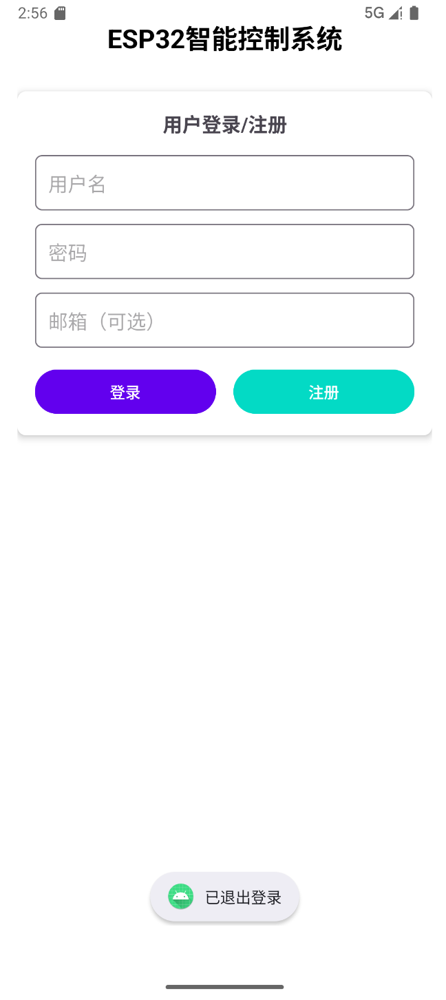
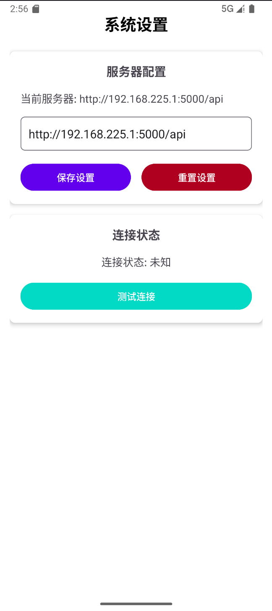
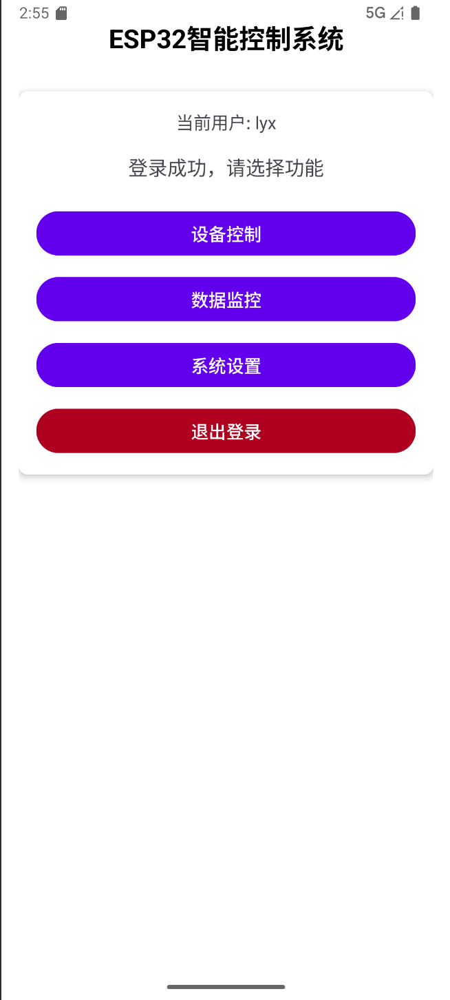
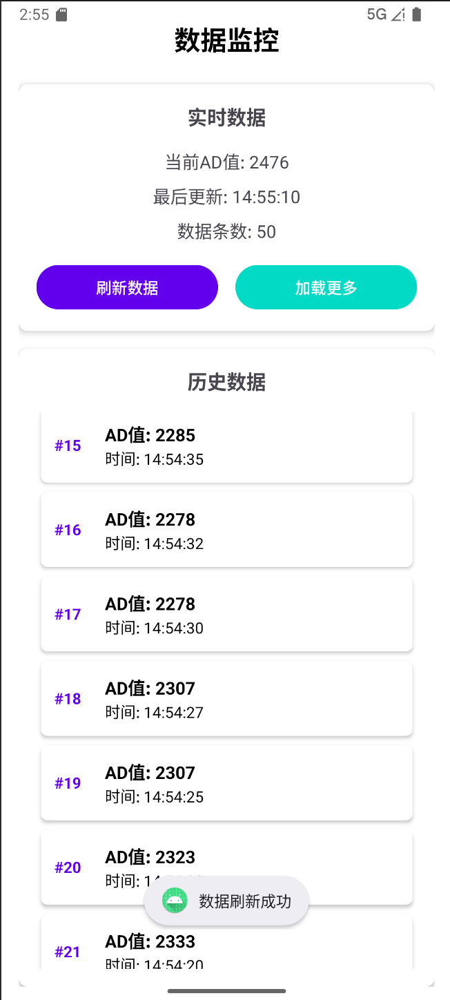
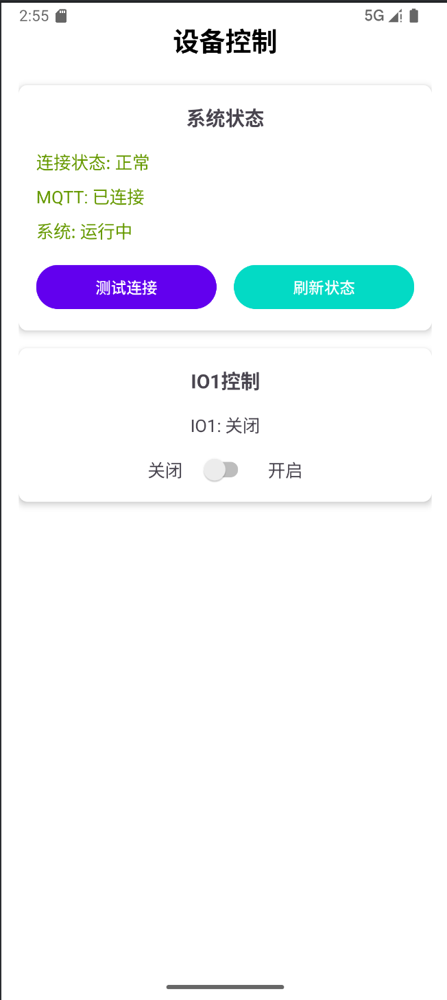

# ESP32智能控制系统 - Android应用

## 📱 项目简介

这是一个基于Android Studio开发的ESP32智能控制系统移动应用，提供完整的用户管理、设备控制和数据监控功能。

## ✨ 主要功能

### 1. 用户管理
- **用户注册**: 支持新用户注册，包含用户名、密码和邮箱
- **用户登录**: 安全的用户身份验证系统
- **本地存储**: 使用SQLite数据库存储用户信息
- **会话管理**: 自动保存登录状态

### 2. 网络连接
- **服务器连接**: 通过WiFi连接到ESP32后端服务器
- **IP配置**: 可配置服务器IP地址和端口
- **连接测试**: 实时测试网络连接状态
- **HTTP通信**: 使用OkHttp3进行REST API调用

### 3. 设备控制
- **IO1控制**: 实时控制ESP32的IO1引脚开关状态
- **状态监控**: 实时显示MQTT连接状态和系统运行状态
- **自动刷新**: 每5秒自动刷新设备状态
- **手动控制**: 支持手动开关控制

### 4. 数据监控
- **AD1数据**: 实时显示ESP32的AD1通道数据
- **历史记录**: 查看数据采集的历史记录
- **分页加载**: 支持分页加载更多历史数据
- **自动更新**: 每10秒自动刷新数据

## 🏗️ 技术架构

### 开发环境
- **语言**: Java 8+
- **最低SDK**: Android 7.0 (API 24)
- **目标SDK**: Android 14 (API 36)
- **开发工具**: Android Studio

### 核心技术
- **网络通信**: OkHttp3 + JSON
- **数据存储**: SQLite + SharedPreferences
- **UI框架**: Material Design + RecyclerView + CardView
- **异步处理**: Handler + Runnable
- **架构模式**: MVC模式

### 项目结构
```
AIIOT/
├── app/src/main/java/com/example/aiiot/
│   ├── MainActivity.java              # 主活动（登录/注册）
│   ├── ControlActivity.java           # 设备控制页面
│   ├── DataMonitorActivity.java       # 数据监控页面
│   ├── SettingsActivity.java          # 设置页面
│   ├── model/
│   │   ├── User.java                  # 用户数据模型
│   │   └── ESP32Data.java            # ESP32数据模型
│   ├── network/
│   │   └── NetworkManager.java        # 网络管理器
│   ├── database/
│   │   └── UserDatabaseHelper.java    # 用户数据库管理器
│   └── adapter/
│       └── DataAdapter.java           # 数据适配器
├── app/src/main/res/
│   ├── layout/                        # 布局文件
│   └── drawable/                      # 资源文件
└── README.md                          # 项目说明
```

## 🚀 快速开始

### 1. 环境准备

#### Android Studio
1. 下载并安装 [Android Studio](https://developer.android.com/studio)
2. 确保已安装Android SDK 24-36

#### 后端服务
确保你的ESP32后端系统正在运行：
```bash
cd AiUiIot
python main.py
```

### 2. 导入项目

1. 打开Android Studio
2. 选择"Open an existing Android Studio project"
3. 选择项目目录：`AIIOT/`
4. 等待Gradle同步完成

### 3. 配置网络

#### 修改默认服务器地址
编辑 `NetworkManager.java` 中的默认服务器地址：
```java
this.baseUrl = prefs.getString("server_url", "http://YOUR_IP:5000/api");
```

#### 或在运行时配置
1. 启动应用
2. 注册并登录账号
3. 进入"系统设置"页面
4. 修改服务器地址
5. 点击"保存"和"测试连接"

### 4. 构建运行

1. 连接Android设备或启动模拟器
2. 点击"Run"按钮
3. 选择目标设备
4. 等待应用安装和启动

## 📋 使用说明

### 基本操作流程

1. **启动应用**
   - 首次使用需要注册账号
   - 输入用户名和密码登录

2. **配置网络**
   - 进入"系统设置"页面
   - 输入服务器IP地址（例如：http://192.168.1.100:5000/api）
   - 测试连接是否正常

3. **监控数据**
   - 进入"数据监控"页面
   - 查看AD1通道实时数据
   - 浏览历史数据记录

4. **控制设备**
   - 进入"设备控制"页面
   - 查看连接状态
   - 使用开关控制IO1

### 网络配置说明

#### 本地网络连接
- 手机和服务器必须在同一WiFi网络
- 服务器默认端口：5000
- 支持HTTP和HTTPS协议
- 默认服务器地址：http://192.168.1.100:5000/api

#### 修改服务器地址
在设置页面输入完整的API地址，格式如下：
```
http://[服务器IP]:[端口]/api
例如：http://192.168.1.100:5000/api
```

## 🔧 配置说明

### 网络配置
```java
// NetworkManager.java
serverConfig: {
  baseUrl: 'http://192.168.1.100:5000/api', // 修改为你的服务器IP
  timeout: 10000  // 请求超时时间(毫秒)
}
```

### 自动刷新配置
```java
// 控制页面自动刷新间隔(毫秒)
private static final int REFRESH_INTERVAL = 5000; // 5秒

// 数据页面自动刷新间隔(毫秒)
private static final int REFRESH_INTERVAL = 10000; // 10秒
```

### 用户管理配置
```java
// 密码最小长度
if (password.length() < 6) {
    Toast.makeText(this, "密码长度至少6位", Toast.LENGTH_SHORT).show();
    return;
}
```

## 📱 界面说明

### 主界面
- **登录/注册**: 用户身份验证
- **功能导航**: 跳转到各个功能页面
- **用户状态**: 显示当前登录用户

### 设备控制界面
- **系统状态**: 显示MQTT连接和设备状态
- **IO1控制**: 开关控制界面
- **连接测试**: 测试网络连接

### 数据监控界面
- **实时数据**: 显示当前AD值和更新时间
- **历史数据**: 分页显示历史记录
- **数据操作**: 刷新和加载更多

### 设置界面
- **服务器配置**: 修改服务器地址
- **连接测试**: 测试网络连接
- **设置重置**: 恢复默认配置

## 📸 应用界面展示

### 1. 应用启动界面


### 2. 用户登录界面


### 3. 连接服务器设置界面


### 4. 设备读数控制导航界面


### 5. 数据监控界面


### 6. 设备控制界面


## 🐛 常见问题

### Q: 应用无法连接到服务器
**A**: 检查以下配置：
1. 服务器IP地址是否正确
2. 手机和服务器是否在同一网络
3. 防火墙是否阻止了5000端口
4. 后端服务是否正在运行

### Q: 控制命令执行失败
**A**: 可能的原因：
1. MQTT连接断开
2. ESP32设备离线
3. 网络延迟过高
4. 后端服务异常

### Q: 数据不更新
**A**: 解决方案：
1. 检查自动刷新是否开启
2. 手动点击刷新按钮
3. 检查网络连接状态
4. 重启应用

### Q: 应用崩溃
**A**: 处理方法：
1. 检查Android版本兼容性
2. 查看Logcat错误信息
3. 清除应用数据重新配置
4. 重新安装应用

## 🔄 更新维护

### 版本更新
1. 修改代码后重新构建
2. 测试功能正常后生成APK
3. 发布新版本

### 功能扩展
- 支持更多传感器数据
- 添加设备管理功能
- 实现用户权限控制
- 增加数据分析和报警功能
- 支持推送通知

## 📞 技术支持

如有问题或建议，请联系开发团队或查看项目文档。

---

**版本**: 1.0.0  
**更新时间**: 2024年1月  
**兼容性**: Android 7.0+ (API 24+)  
**后端要求**: ESP32 Python后端系统

## 🐍 Python后端准备和启动过程

### 📋 前置要求

#### 1. Python环境
- **Python版本**: 3.7 或更高版本
- **操作系统**: Windows 10/11, macOS, Linux
- **包管理器**: pip (Python自带)

#### 2. 系统要求
- **内存**: 至少 2GB RAM
- **存储**: 至少 500MB 可用空间
- **网络**: 支持TCP/IP网络连接

### 🚀 安装步骤

#### 第一步：安装Python依赖包
```bash
# 进入项目目录
cd AiUiIot

# 运行依赖安装脚本
install_dependencies.bat
```

**安装的包包括**:
- `paho-mqtt==1.6.1` - MQTT客户端库
- `flask==2.3.3` - Web框架
- `flask-cors==4.0.0` - 跨域支持
- `schedule==1.2.0` - 任务调度

#### 第二步：安装MQTT代理
```bash
# 运行MQTT安装脚本
install_mqtt.bat
```

**MQTT代理功能**:
- 消息路由和转发
- 支持QoS级别
- 自动重连机制
- 安全认证支持

#### 第三步：配置系统
```bash
# 检查配置文件
config.ini
```

**主要配置项**:
```ini
[MQTT]
broker = localhost          # MQTT代理地址
port = 1883                # MQTT端口

[WEB_SERVER]
host = 0.0.0.0             # Web服务器地址
port = 5000                # Web服务器端口

[ESP32_SIMULATOR]
enabled = True             # 启用模拟器
simulation_interval = 5    # 模拟间隔（秒）
```

### 🔧 启动过程

#### 1. 系统启动脚本
```bash
# 一键启动系统
start_system.bat
```

**启动过程包括**:
1. **环境检查** - Python版本、依赖包、配置文件
2. **MQTT服务启动** - 检查并启动Mosquitto服务
3. **数据库初始化** - 创建SQLite数据库和表结构
4. **Web服务器启动** - 启动Flask Web服务
5. **ESP32模拟器启动** - 启动数据模拟器

#### 2. 手动启动方式
```bash
# 直接运行Python程序
python main.py
```

#### 3. 启动验证
```bash
# 运行系统测试脚本
test_system.bat
```

### 📊 系统架构

```
┌─────────────────┐    ┌─────────────────┐    ┌─────────────────┐
│   ESP32设备     │◄──►│   Python后端    │◄──►│   Android应用   │
│                 │    │                 │    │                 │
│ • AD1数据采集   │    │ • MQTT客户端    │    │ • 用户界面      │
│ • IO1控制       │    │ • Web服务器     │    │ • 设备控制      │
│ • 状态监控      │    │ • 数据库管理    │    │ • 数据监控      │
└─────────────────┘    │ • 数据模拟器    │    └─────────────────┘
                       └─────────────────┘
```

### 🔍 启动检查清单

#### 启动前检查
- [ ] Python 3.7+ 已安装
- [ ] 依赖包已安装 (`install_dependencies.bat`)
- [ ] MQTT代理已安装 (`install_mqtt.bat`)
- [ ] 配置文件 `config.ini` 存在
- [ ] 端口5000未被占用

#### 启动后验证
- [ ] MQTT服务运行正常 (端口1883)
- [ ] Web服务器可访问 (http://localhost:5000)
- [ ] 数据库文件已创建 (`esp32_data.db`)
- [ ] ESP32模拟器正在发送数据
- [ ] Android应用可正常连接

### 🛠️ 故障排除

#### 常见启动问题

**1. 端口被占用**
```bash
# 检查端口占用
netstat -an | findstr :5000
# 或使用
netstat -an | findstr :1883
```

**2. MQTT服务启动失败**
```bash
# 检查服务状态
sc query mosquitto
# 手动启动服务
net start mosquitto
```

**3. Python模块导入错误**
```bash
# 重新安装依赖
pip install -r requirements.txt
```

**4. 权限不足**
- 以管理员身份运行命令提示符
- 检查防火墙设置
- 确认用户权限

### 📝 日志和监控

#### 日志文件位置
```
logs/
└── esp32_backend_YYYYMMDD.log
```

#### 实时监控
- **控制台输出**: 启动时的实时日志
- **Web界面**: http://localhost:5000/api/status
- **数据库**: 使用SQLite工具查看数据

#### 性能指标
- **响应时间**: API接口响应延迟
- **数据吞吐量**: MQTT消息处理速度
- **内存使用**: Python进程内存占用
- **连接数**: 并发连接数量

### 🔄 维护和更新

#### 定期维护
1. **日志清理** - 定期清理旧日志文件
2. **数据库优化** - 清理过期数据
3. **依赖更新** - 更新Python包版本
4. **配置备份** - 备份重要配置文件

#### 版本升级
1. **备份数据** - 备份数据库和配置
2. **停止服务** - 停止当前运行的服务
3. **更新代码** - 拉取最新代码
4. **重新安装依赖** - 安装新版本依赖
5. **启动服务** - 启动更新后的服务

---

**注意**: 首次启动可能需要较长时间，请耐心等待所有服务初始化完成。
